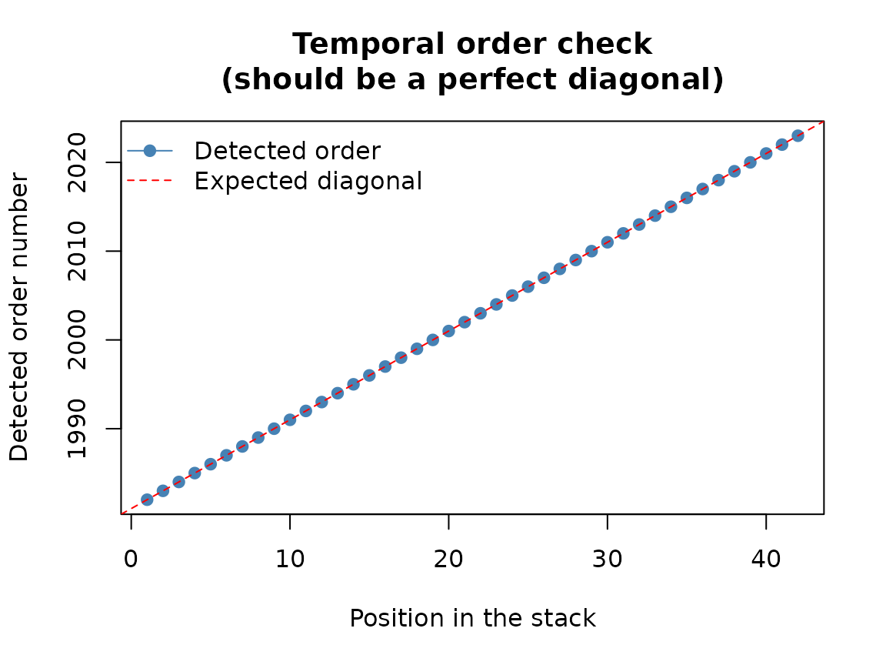
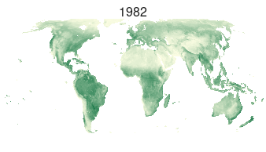

# 0. Loading and exploring spatiotemporal data

``` r

library(sptrends)
```

## Why this matters

sptrends analyses spatiotemporal trends in gridded environmental data.
These datasets commonly exhibit serial correlation and spatial
dependence, while analysing many cells simultaneously creates a
large-scale multiple-testing problem. Because these challenges interact
to affect statistical inference, sptrends keeps the main analytical
stages explicit and separate: serial-correlation assessment and
treatment, trend testing, slope estimation and multiple-testing
correction. These stages may be used independently or combined within
complete analytical workflows.

This is not simply a sequence of steps assembled for convenience. True
Significant Trends (TST), introduced by [Gutiérrez-Hernández and García
(2025)](https://doi.org/10.1016/j.rsase.2024.101377), is the
methodological origin of this design: it identified these three
challenges as interconnected facets of the same underlying problem, not
as separate issues to be patched independently, and sptrends inherits
that understanding rather than just its pipeline.

This vignette shows how to recognise, inspect and visualise the input,
and how the main analytical stages fit together. Later vignettes explain
each methodological decision.

## What `read_ordered_stack()` and `read_netcdf_stack()` do

The usual analytical input is a
[`terra::SpatRaster`](https://rspatial.github.io/terra/reference/SpatRaster-class.html)
with one layer per time step, ordered from earliest to latest. It can be
created from chronologically ordered raster files with
[`read_ordered_stack()`](https://olivergh.github.io/sptrends/reference/read_ordered_stack.md)
or imported from NetCDF datasets with
[`read_netcdf_stack()`](https://olivergh.github.io/sptrends/reference/read_netcdf_stack.md).
Across these layers, each valid raster cell defines an individual time
series embedded within a spatially structured dataset. Analytical
results are returned as structured `sptrends` objects with familiar
[`print()`](https://rdrr.io/r/base/print.html),
[`summary()`](https://rdrr.io/r/base/summary.html) and
[`plot()`](https://rdrr.io/r/graphics/plot.default.html) methods.

## Basic workflow

The bundled example is an annual NDVI series derived from the [NOAA STAR
Blended Vegetation Health Product
(Blended-VHP)](https://www.star.nesdis.noaa.gov/smcd/emb/vci/VH/vh_ftp.php).
The data were spatially resampled to a coarser 100 km resolution to
enable faster execution of the examples and reprojected to an [Eckert
IV](https://map-projections.net/compare.php?p1=eckert-4&p2=equalearth&w=1&sm=1&d=1)
equal-area grid so that every raster cell represents the same surface
area. An equal-area projection is not required by sptrends, but this
consideration is often overlooked and becomes important when
interpreting cell counts, spatial proportions or area-based summaries.

``` r

r <- read_ordered_stack(example_data("vhp_ndvi"))
#> Temporal order auto-detected with pattern '(19[0-9]{2}|20[0-9]{2})'.
#> Temporal order verification (mandatory, cannot be skipped):
#>  stack_position detected_number                         file
#>               1            1982 VHP_SMN_annual_ndvi_1982.tif
#>               2            1983 VHP_SMN_annual_ndvi_1983.tif
#>               3            1984 VHP_SMN_annual_ndvi_1984.tif
#>               4            1985 VHP_SMN_annual_ndvi_1985.tif
#>               5            1986 VHP_SMN_annual_ndvi_1986.tif
#>               6            1987 VHP_SMN_annual_ndvi_1987.tif
#>               7            1988 VHP_SMN_annual_ndvi_1988.tif
#>               8            1989 VHP_SMN_annual_ndvi_1989.tif
#>               9            1990 VHP_SMN_annual_ndvi_1990.tif
#>              10            1991 VHP_SMN_annual_ndvi_1991.tif
#>              11            1992 VHP_SMN_annual_ndvi_1992.tif
#>              12            1993 VHP_SMN_annual_ndvi_1993.tif
#>              13            1994 VHP_SMN_annual_ndvi_1994.tif
#>              14            1995 VHP_SMN_annual_ndvi_1995.tif
#>              15            1996 VHP_SMN_annual_ndvi_1996.tif
#>              16            1997 VHP_SMN_annual_ndvi_1997.tif
#>              17            1998 VHP_SMN_annual_ndvi_1998.tif
#>              18            1999 VHP_SMN_annual_ndvi_1999.tif
#>              19            2000 VHP_SMN_annual_ndvi_2000.tif
#>              20            2001 VHP_SMN_annual_ndvi_2001.tif
#>              21            2002 VHP_SMN_annual_ndvi_2002.tif
#>              22            2003 VHP_SMN_annual_ndvi_2003.tif
#>              23            2004 VHP_SMN_annual_ndvi_2004.tif
#>              24            2005 VHP_SMN_annual_ndvi_2005.tif
#>              25            2006 VHP_SMN_annual_ndvi_2006.tif
#>              26            2007 VHP_SMN_annual_ndvi_2007.tif
#>              27            2008 VHP_SMN_annual_ndvi_2008.tif
#>              28            2009 VHP_SMN_annual_ndvi_2009.tif
#>              29            2010 VHP_SMN_annual_ndvi_2010.tif
#>              30            2011 VHP_SMN_annual_ndvi_2011.tif
#>              31            2012 VHP_SMN_annual_ndvi_2012.tif
#>              32            2013 VHP_SMN_annual_ndvi_2013.tif
#>              33            2014 VHP_SMN_annual_ndvi_2014.tif
#>              34            2015 VHP_SMN_annual_ndvi_2015.tif
#>              35            2016 VHP_SMN_annual_ndvi_2016.tif
#>              36            2017 VHP_SMN_annual_ndvi_2017.tif
#>              37            2018 VHP_SMN_annual_ndvi_2018.tif
#>              38            2019 VHP_SMN_annual_ndvi_2019.tif
#>              39            2020 VHP_SMN_annual_ndvi_2020.tif
#>              40            2021 VHP_SMN_annual_ndvi_2021.tif
#>              41            2022 VHP_SMN_annual_ndvi_2022.tif
#>              42            2023 VHP_SMN_annual_ndvi_2023.tif
```



    #> Stack built: 42 layers, 146 x 338 cells.
    #> >> [read_ordered_stack()] elapsed: 2.87 s
    r
    #> class       : SpatRaster
    #> size        : 146, 338, 42  (nrow, ncol, nlyr)
    #> resolution  : 100000, 100000  (x, y)
    #> extent      : -1.691185e+07, 1.688815e+07, -6569957, 8030043  (xmin, xmax, ymin, ymax)
    #> coord. ref. : World_Eckert_IV
    #> source(s)   : memory
    #> names       : VHP_S~_1982, VHP_S~_1983, VHP_S~_1984, VHP_S~_1985, VHP_S~_1986, VHP_S~_1987, ...
    #> min values  :    0.000019,    0.000038,    0.000019,    0.000038,    0.000019,    0.000019, ...
    #> max values  :    0.535432,    0.513679,    0.520081,    0.550945,    0.526776,    0.526885, ...
    #> time (years): 1982-00-00 to 2023-00-00 (42 steps)
    terra::nlyr(r)
    #> [1] 42
    terra::time(r)
    #>  [1] 1982 1983 1984 1985 1986 1987 1988 1989 1990 1991 1992 1993 1994 1995 1996
    #> [16] 1997 1998 1999 2000 2001 2002 2003 2004 2005 2006 2007 2008 2009 2010 2011
    #> [31] 2012 2013 2014 2015 2016 2017 2018 2019 2020 2021 2022 2023

The imported object contains 42 annual observations spanning 1982–2023.
Before beginning any trend analysis, it is good practice to verify that
the temporal ordering has been detected correctly and that the raster
series matches the expected study period.

Start by viewing the complete series and checking the temporal order:

``` r

ndvi_col <- rev(grDevices::hcl.colors(50, "Greens 3"))
terra::plot(
  r, col = ndvi_col, colNA = "transparent", nc = 6,
  maxnl = terra::nlyr(r)
)
```


The same layers can be displayed sequentially in an interactive R
session:



Annual mean NDVI, 1982–2023

The embedded animation uses the same 42 layers shown in the mosaic. To
reproduce it interactively from the original raster series, run:

``` r

terra::animate(
  r,
  pause = 0.2,
  main = as.character(terra::time(r)),
  col = ndvi_col,
  colNA = "transparent"
)
```

## Understanding the results

So far you have only looked at the raw data. Once an analytical function
has actually been run – in any of the vignettes that follow – its output
presents itself the same way throughout the package: analytical
functions return structured objects with familiar
[`print()`](https://rdrr.io/r/base/print.html),
[`summary()`](https://rdrr.io/r/base/summary.html) and
[`plot()`](https://rdrr.io/r/graphics/plot.default.html) methods.
Complete workflows retain their intermediate results, so users can
examine every analytical stage rather than treating the workflow as a
black box.

## Choosing the main options

| Your question | Where to continue |
|----|----|
| Is temporal dependence a problem? | [Prewhitening vignette](https://olivergh.github.io/sptrends/articles/b-prewhitening.md) |
| Is there evidence of a trend? | [Trend-test vignette](https://olivergh.github.io/sptrends/articles/c-trend-test.md) |
| How large is the change? | [Slope-estimation vignette](https://olivergh.github.io/sptrends/articles/d-slope-estimation.md) |
| Which findings survive multiple testing? | [Multiple-testing vignette](https://olivergh.github.io/sptrends/articles/e-fdr-correction.md) |
| How do I combine the stages? | [Trend-workflows vignette](https://olivergh.github.io/sptrends/articles/g-workflow-trends.md) |

## Common mistakes

- Do not assume layers are in chronological order; confirm it directly
  before analysis.
- Do not treat missing-value codes as valid observations.
- Do not interpret raster-cell counts or proportions as surface area
  without considering the projection and cell size; use an equal-area
  grid when area-based comparisons or summaries are required.
- Do not assume that observations are independent, whether across time
  (serial correlation, see [prewhitening
  vignette](https://olivergh.github.io/sptrends/articles/b-prewhitening.md))
  or across neighbouring cells (spatial dependence, see [trend-test
  vignette](https://olivergh.github.io/sptrends/articles/c-trend-test.md));
  both are common in gridded environmental time series and affect
  inference.
- Do not treat cell-wise tests as isolated analyses; testing many raster
  cells simultaneously creates a large-scale multiple-testing problem
  (see [multiple-testing
  vignette](https://olivergh.github.io/sptrends/articles/e-fdr-correction.md)).

## Next steps

Continue to
[`vignette("b-prewhitening")`](https://olivergh.github.io/sptrends/articles/b-prewhitening.md),
or go directly to
[`vignette("c-trend-test")`](https://olivergh.github.io/sptrends/articles/c-trend-test.md)
if temporal preprocessing is unnecessary.

## Further details

See
[`?sptrends`](https://olivergh.github.io/sptrends/reference/sptrends-package.md)
for the function index and quality-assurance protocol,
[`?read_ordered_stack`](https://olivergh.github.io/sptrends/reference/read_ordered_stack.md)
and
[`?read_netcdf_stack`](https://olivergh.github.io/sptrends/reference/read_netcdf_stack.md)
for data import, and
[`?inspect_ts_cell`](https://olivergh.github.io/sptrends/reference/inspect_ts_cell.md)
for interactive exploration.

## References

- Gutiérrez-Hernández, O. and García, L.V. (2025) Uncovering True
  Significant Trends in Global Greening. *Remote Sensing Applications*,
  101377. <https://doi.org/10.1016/j.rsase.2024.101377>
